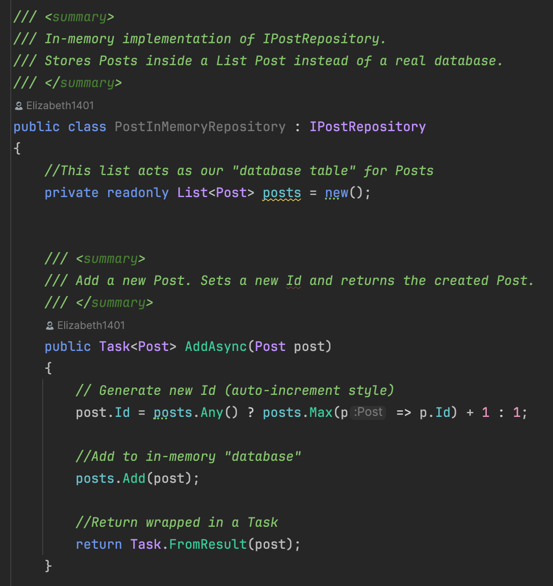
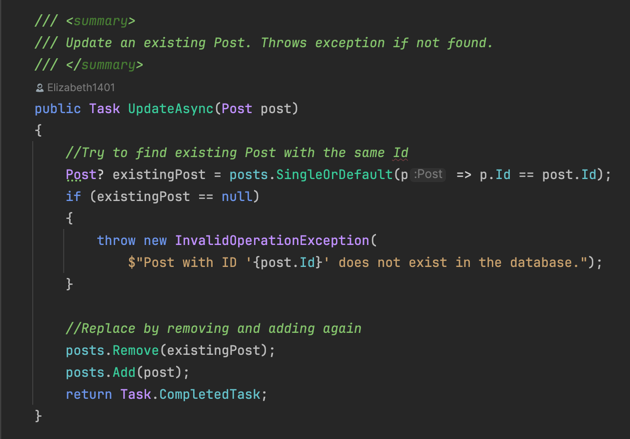
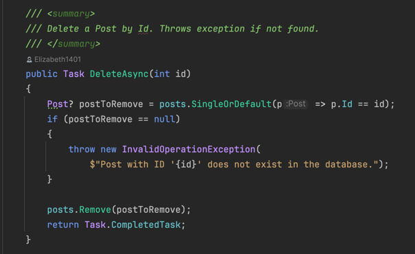
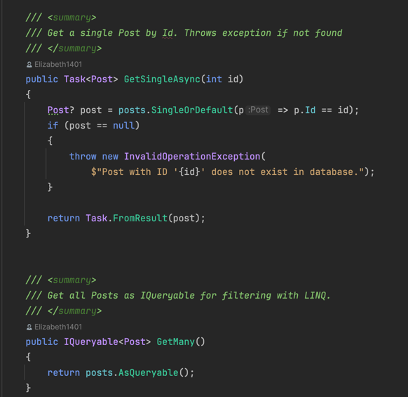

**Entities Overview**

In this project, I model three core entities: User, Post, Comment.

I follow a relational-database style approach:

- Every entity has a primary key (Id of type int).
- Relationships are modeled using *Foreign keys* rather than associations or references.

**User**

Represents a person who interacts with the system

- **Id (int)** -> Primary Key
- **Username (string)** -> The unique name chosen by the user.
- **Password (string)** -> The user's password

A user can:

- Write **Posts**
- Write **Comments**

**Post**

Represents a message created by user.

- **Id (int)** -> Primary Key
- **Title (string)** -> The title of the post
- **Body (string)** -> The content of the post
- **UserId (int)** -> Foreign Key referencing the **User** who wrote the post

A post can have multiple **Comments**, but we model this via *PostId* foreign key inside *Comment*.

**Comment** 

Represents a user's reply to a post.

- **Id (int)** -> Primary Key
- **Body (string)** -> The text of the comment
- **UserId (int)** -> Foreign key referencing the **User** who wrote the comment
- **PostId (int)** -> Foreign key referencing the **Post** the comment belongs to

---
**Repository Layer**

**What is a Repository?**
A **Repository** is an abstraction of data access for a single entity.
- Each entity (e.g., User, Post, Comment) has its own repository interface.
- The repository hides how data is stored (List, file, database, etc.).
- Higher layers (CLI, Web API, etc.) work only with the repository interface, not the actual storage.

This creates a **layered architecture** where:

- The **presentation/network layer** (CLI, Web API) can change.
- The **persistence layer** (List, file, DB) can change.
- But the **repository interface remain the same**.

---
**CRUD Methods**

Each repository interface defines **5 standard CRUD operations:**

1. **Add**
- Stores a new entity
- Returns the created entity (with *Id* set by the system)
2. **Update**
- Updates an existing entity
- If the entity does not exist, an exception is thrown
3. **Delete**
- Deletes an entity by its *Id*
- If no entity is found, an exception is thrown
4. **GetSingle**
- Returns the entity matching the given *id*
- If not found, an exception is thrown
5. **GetMany**
- Returns an *IQueryable* with multiple entities
- Supports iteration (foreach) and filtering using LINQ

---
**Task and Async**

- *Task T* = represents an operation that will eventually return a result of type *T*.
- *Task* = represents an operation that will eventually complete (but has no return value).
- Methods are suffixed with *Async* by convertion (e.g., AddAsync).
- This enables **asynchronous programming**, where different operations (e.g., read from a DB oe file) can run concurrently.

---
**In Memory Repository Inmlementation**

---
**Dummy Data Initialization**

To make testing easier, each in-memory repository (User, Comment, Post) comes preloaded with some sample data.

This ensures the application has content right after startup, making it easier to test CRUD operations.

---
## CLI 
**Purpose**

This project is a **C# .NET console application** that simulates a mini blog system with **Users, Posts, and Comments.**
The main goals were to practice:

- **Repository Pattern**

- **Dependency Injection**

- **Asynchronous programming (async/await)**

- **Clean UI design (views split by responsibility)**

- **Initial dummy data seeding**
---
## Core Concepts in this project

**Dependency Injection**

- We only instantiate repos in **Program.cs**
- These are passed into CliApp, and further into views.

**WHY?**

- Keeps all parts of app working on the same instance.

- Easy to replace InMemoryRepository with DbRepository later.

- Avoids “new UserInMemoryRepository()” being spread all over your code (which would break data consistency).

---
**Asynchronous Programming**

- In .NET, data access is often **I/O bound** (files, DB, network). Async keeps the app responsive.
- Any repo method that touches data is async:

  *User user = await userRepo.AddAsync(new User {...});*

- To use await, the method itself must be async Task:

  *private async Task CreateUserAsync()*

  *{*

  *User created = await userRepository.AddAsync(user);*
  *Console.WriteLine(created.Id);*

  *}*
- **Turtles all the way down** → if you call async, your method must be async, and so on, all the way to Main.

- That’s why Program.cs has: *await cliApp.StartAsync();*

---
**UI Design (Views)**

- Instead of one giant CLI class, we split into small, single-responsibility views:

- - CreateUserView → only user creation

- - ListUsersView → only listing users

- - CreatePostView, ListPostsView, SinglePostView, AddCommentView

- This improves readability, testability, and teamwork.

This follows **Single Responsibility Principle (SRP)** from SOLID

---