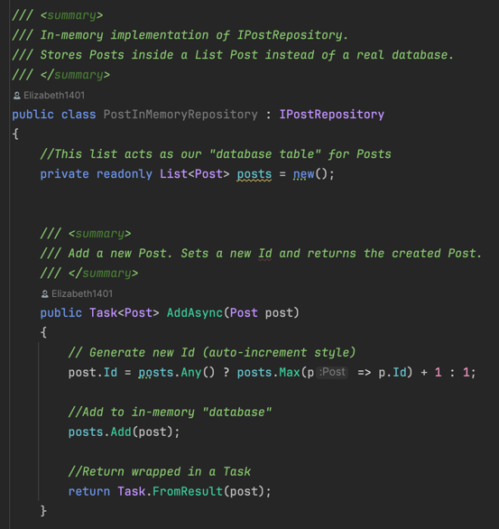
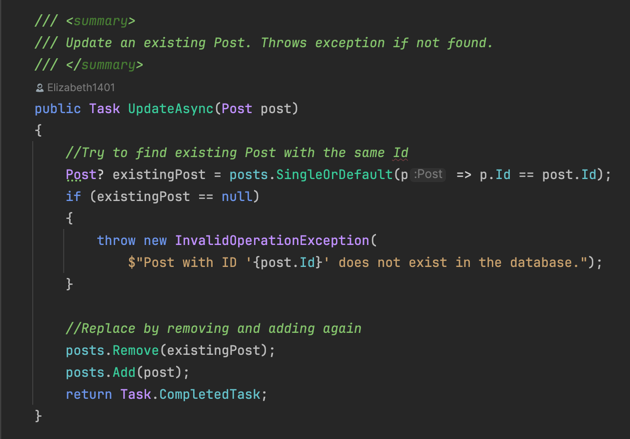
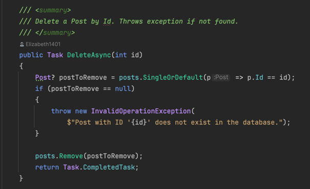
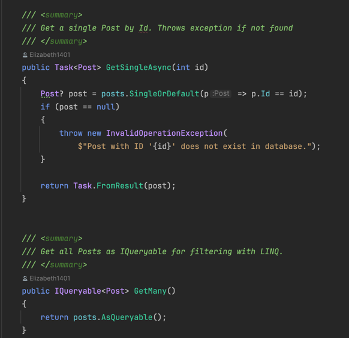

**Entities Overview**

In this project, I model three core entities: User, Post, Comment.

I follow a relational-database style approach:

- Every entity has a primary key (Id of type int).
- Relationships are modeled using *Foreign keys* rather than associations or references.

**User**

Represents a person who interacts with the system

- **Id (int)** -> Primary Key
- **Username (string)** -> The unique name chosen by the user.
- **Password (string)** -> The user's password

A user can:

- Write **Posts**
- Write **Comments**

**Post**

Represents a message created by user.

- **Id (int)** -> Primary Key
- **Title (string)** -> The title of the post
- **Body (string)** -> The content of the post
- **UserId (int)** -> Foreign Key referencing the **User** who wrote the post

A post can have multiple **Comments**, but we model this via *PostId* foreign key inside *Comment*.

**Comment** 

Represents a user's reply to a post.

- **Id (int)** -> Primary Key
- **Body (string)** -> The text of the comment
- **UserId (int)** -> Foreign key referencing the **User** who wrote the comment
- **PostId (int)** -> Foreign key referencing the **Post** the comment belongs to

**Repository Layer**

**What is a Repository?**
A **Repository** is an abstraction of data access for a single entity.
- Each entity (e.g., User, Post, Comment) has its own repository interface.
- The repository hides how data is stored (List, file, database, etc.).
- Higher layers (CLI, Web API, etc.) work only with the repository interface, not the actual storage.

This creates a **layered architecture** where:

- The **presentation/network layer** (CLI, Web API) can change.
- The **persistence layer** (List, file, DB) can change.
- But the **repository interface remain the same**.

**CRUD Methods**

Each repository interface defines **5 standard CRUD operations:**

1. **Add**
- Stores a new entity
- Returns the created entity (with *Id* set by the system)
2. **Update**
- Updates an existing entity
- If the entity does not exist, an exception is thrown
3. **Delete**
- Deletes an entity by its *Id*
- If no entity is found, an exception is thrown
4. **GetSingle**
- Returns the entity matching the given *id*
- If not found, an exception is thrown
5. **GetMany**
- Returns an *IQueryable* with multiple entities
- Supports iteration (foreach) and filtering using LINQ

**Task and Async**

- *Task T* = represents an operation that will eventually return a result of type *T*.
- *Task* = represents an operation that will eventually complete (but has no return value).
- Methods are suffixed with *Async* by convertion (e.g., AddAsync).
- This enables **asynchronous programming**, where different operations (e.g., read from a DB oe file) can run concurrently.

**In Memory Repository Inmlementation**

